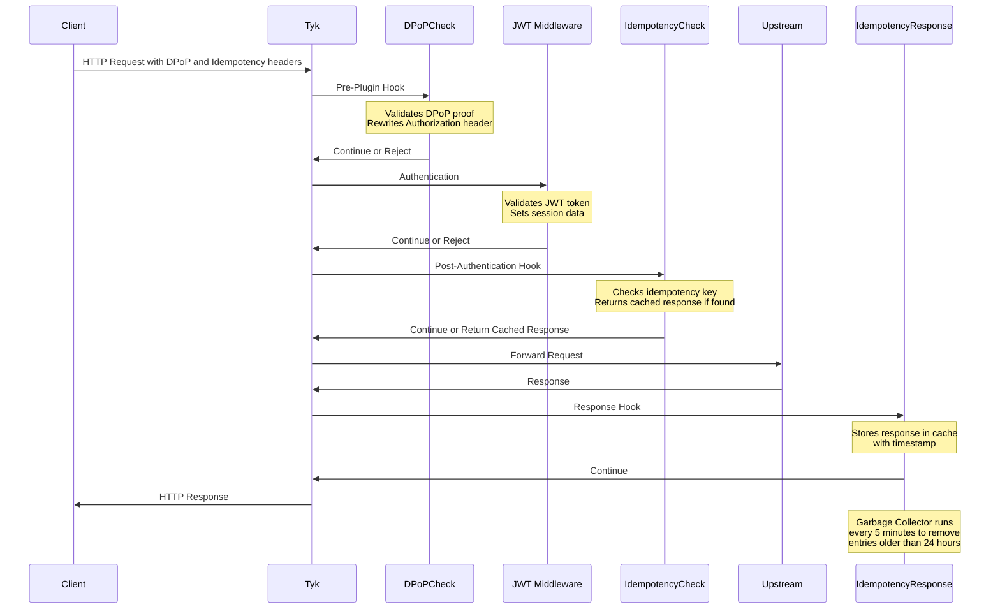

# Tyk gRPC Plugin for FAPI with DPoP

This is a gRPC plugin for Tyk API Gateway that implements DPoP (Demonstrating Proof of Possession) authentication for FAPI (Financial-grade API) compliance.

## Features

- Single DPoP validation hook: Validates DPoP proof and claims in a single step, including:
  - Checking for the existence of Authorization and DPoP headers
  - Rewriting `Authorization: DPoP <token>` to `Authorization: Bearer <token>` for compatibility with Tyk's JWT middleware
  - Extracting the DPoP fingerprint (jkt) from the token
  - Validating the DPoP proof against the fingerprint
  - Removing the DPoP header before forwarding the request upstream

- Idempotency support: Ensures that repeated requests with the same idempotency key produce the same result:
  - Validates idempotency keys in request headers
  - Caches responses for idempotent requests
  - Returns cached responses for repeated requests with the same idempotency key
  - Includes automatic garbage collection of expired idempotency entries (older than 24 hours)

## Requirements

- Tyk API Gateway
- Docker (for building and running the plugin)

## Building and Running

### Using Docker

1. Build the Docker image:
   ```
   docker build -t tyk-grpc-plugin-fapi .
   ```

2. Run the container:
   ```
   docker run -p 5555:5555 tyk-grpc-plugin-fapi
   ```

### Manual Build

1. Install Protocol Buffers compiler:
   ```
   # macOS
   brew install protobuf

   # Ubuntu
   apt-get install -y protobuf-compiler
   ```

2. Install Go protobuf plugins:
   ```
   go install google.golang.org/protobuf/cmd/protoc-gen-go@v1.28.1
   go install google.golang.org/grpc/cmd/protoc-gen-go-grpc@v1.2.0
   ```

3. Generate protobuf code:
   ```
   mkdir -p proto/gen/proto
   protoc --go_out=proto/gen/proto --go_opt=paths=source_relative \
          --go-grpc_out=proto/gen/proto --go-grpc_opt=paths=source_relative \
          proto/coprocess.proto
   ```

4. Build the plugin:
   ```
   go build -o tyk-grpc-plugin-fapi
   ```

5. Run the plugin:
   ```
   ./tyk-grpc-plugin-fapi
   ```

## Configuring Tyk

1. Update your Tyk configuration file (`tyk.conf`) to enable gRPC plugins:
   ```json
   {
     "coprocess_options": {
       "enable_coprocess": true,
       "coprocess_grpc_server": "tcp://localhost:5555"
     }
   }
   ```

2. Configure your API definition to use the gRPC plugin:
```yaml
middleware:
  global:
    contextVariables:
      enabled: true
    pluginConfig:
      driver: grpc
    postAuthenticationPlugins:
      - enabled: true
        functionName: IdempotencyCheck
        path: ''
        requireSession: true
    prePlugins:
      - enabled: true
        functionName: DPoPCheck
        path: ''
        rawBodyOnly: true
    responsePlugins:
      - enabled: true
        functionName: IdempotencyResponse
        path: ''
        requireSession: true
    trafficLogs:
      enabled: true
```

## How It Works

This plugin provides multiple hooks that can be enabled independently in your API definition based on your specific requirements. Each hook serves a different purpose and operates at a different stage of the request lifecycle.

### Request Flow Sequence Diagram



### Hook Descriptions

#### 1. DPoP Check (Pre-Plugin Hook)
This hook runs before any authentication and validates the DPoP proof:
- Checks for the existence of Authorization and DPoP headers
- Rewrites `Authorization: DPoP <token>` to `Bearer <token>` for compatibility with Tyk's JWT middleware
- Validates the DPoP proof against the fingerprint in the token
- Removes the DPoP header before forwarding the request
- Rejects requests with missing or invalid headers/tokens

#### 2. JWT Authentication (Tyk Built-in)
Tyk's built-in JWT middleware:
- Validates the JWT token (signature, expiration, etc.)
- Sets session data for downstream hooks

#### 3. Idempotency Check (Post-Authentication Hook)
This hook runs after authentication and checks for idempotent requests:
- Checks for the existence of the X-Idempotency-Key header
- Uses the client ID from the authenticated session to namespace idempotency keys
- If the key exists in the cache, checks if the request body hash matches
- If the request body matches, returns the cached response with X-Idempotent-Replay header
- If the request body doesn't match, returns a 422 Unprocessable Entity error
- If the key hasn't been seen before, allows the request to proceed

#### 4. Idempotency Response (Response Hook)
This hook runs after receiving a response from the upstream service:
- Captures the response for requests with an X-Idempotency-Key header
- Stores the response in the idempotency store with a timestamp
- Ensures responses can be replayed for future identical requests

#### 5. Idempotency Garbage Collector (Background Process)
A background process that maintains the idempotency store:
- Runs automatically every 5 minutes
- Removes entries from the idempotency store that are older than 24 hours
- Logs information about removed entries
- Maintains metrics about the cleaning process

### Important Notes

- **Independent Configuration**: Each hook can be enabled or disabled independently in your API definition
- **Hook Order**: The hooks execute in the order shown in the sequence diagram
- **Session Requirements**: Idempotency hooks require an authenticated session to access the client ID

## Using Idempotency

Idempotency is a critical feature for financial APIs, ensuring that operations are not accidentally performed multiple times. This is particularly important for operations like payments, where duplicate transactions could lead to significant issues.

### How to Use Idempotency

1. **Enable the Idempotency Hooks**: Configure your API definition to include both the `IdempotencyCheck` and `IdempotencyResponse` hooks as shown in the configuration example above.

2. **Include Idempotency Key in Requests**: For operations that should be idempotent, include an `X-Idempotency-Key` header with a unique value (typically a UUID) in your request.

3. **Client Authentication**: The idempotency system uses the client ID from the authenticated session to namespace idempotency keys, so requests must be authenticated.

4. **Handling Responses**:
   - **First Request**: The request is processed normally and the response is cached
   - **Subsequent Identical Requests**: If you send the same request with the same idempotency key and identical body, the cached response is returned with an `X-Idempotent-Replay: true` header
   - **Conflicting Requests**: If you send a request with the same idempotency key but different body, a 422 Unprocessable Entity error is returned

5. **Expiration**: Idempotency keys automatically expire after 24 hours (configurable in the plugin)

### Example Request

```http
POST /account-information/account-access-consents HTTP/1.1
Host: api.example.com
Content-Type: application/json
X-Idempotency-Key: 550e8400-e29b-41d4-a716-446655440000
Authorization: DPoP eyJhbGciOiJFUzI1NiIsInR5cCI6IkpXVCJ9...

{
  "Data": {
    "Permissions": ["ReadAccountsDetail", "ReadBalances"]
  },
  "Risk": {}
}
```

### Example Response (Replay)

```http
HTTP/1.1 201 Created
Content-Type: application/json
X-Idempotent-Replay: true

{
  "Data": {
    "ConsentId": "abc123",
    "Status": "AwaitingAuthorisation",
    "CreationDateTime": "2025-05-08T00:00:00Z",
    "Permissions": ["ReadAccountsDetail", "ReadBalances"]
  },
  "Risk": {},
  "Links": {
    "Self": "https://api.example.com/account-access-consents/abc123"
  }
}
```

### Best Practices

1. **Generate Unique Keys**: Always generate a new unique idempotency key for each logical operation
2. **Store Keys Client-Side**: Store idempotency keys on the client side for retry scenarios
3. **Use UUIDs**: UUIDs are recommended for idempotency keys to ensure uniqueness
4. **Consistent Keys**: Use the same idempotency key for retries of the same logical operation
5. **Key Lifetime**: Design your system with the understanding that keys expire after 24 hours